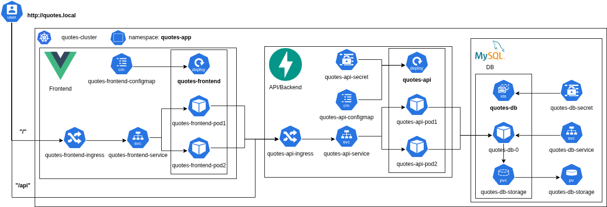

# Full Stack App with Infrastructure Deployment

## 🏠 Project Overview

A complete full-stack application with a front-end landing page, a backend API, and a database, deployed using Helm within a local Kubernetes cluster managed by Kind.

## 🚀 Architecture



## ⚙️ Technologies Used

- **Vue.js**: lets you create simple Single Page Applications (SPA) without generating much boilerplate code
- **FastApi**: uses SQLModel for data modelling, and underneath uses SQLAlchemy and Pydantic with *type hints*. Also allows CORS configuration to receive requests from the Frontend.
- **MySQL**: integrates really well with the modelling done in the API through SQLModel/SQLAlchemy.
- **Nginx**: to serve the Frontend.
- **Docker**: to containerize all services.
- **Kubernetes / Kind**: lets you create a Kubernetes local cluster, has a great integration with Nginx Ingress Controller, works really well and accepts CORS configuration to receive requests from the Frontend.
- **Helm**: to automate deployment and templating of the manifests.
- **kubectl**: to apply manifests that are outside of the Helm charts and if you want to use plain Kubernetes manifests as an option too.

## 🚧 Setup & Deployment

### 🔧 Prerequisites

- Docker
- Kind
- kubectl & Helm

### Deploying to K8S (Kind + Helm/Kubectl)

You can deploy the entire application using the deployment script **deploy.sh** located at the root of the project.

```bash
./deploy.sh helm v0.1.0 v0.1.1
```

#### deploy.sh

```bash
./deploy.sh
Usage: ./deploy.sh [manifests|helm] [ACTUAL_IMG_VERSION] [IMG_VERSION]
  manifests: Apply Kubernetes manifests directly
  helm: Apply Helm charts
  ACTUAL_IMG_VERSION: Actual version of the Docker images to build and load (e.g., v0.1.0), check manifests and helm charts for the correct version
  IMG_VERSION: Version of the Docker images to build and load (e.g., v0.1.1), this is the version that will be used in the manifests and helm charts
Example: ./deploy.sh manifests v0.1.0 v0.1.1
```

The script applies the following actions:

- Creates the Kubernetes cluster locally using Kind and a custom configuration *kind-cluster-config.yaml*.
- Installs the Ingress Nginx Controller.
- Builds the application code and Docker images for each module (backend, frontend) and pushes those images into the cluster.
- Replaces the new version of the images in the manifests and Helm values.yaml files, you need to know the actual version to change it.
- Applies the manifests into the cluster, you have two options: Apply Helm charts, or apply plain Kubernetes manifests.

## 📖 Documentation

### Project structure:​

```text
 .
├──  backend
│  └──  api
│     ├──  config
│     ├──  models
│     └──  routers
├──  docs
├──  frontend
│  └──  src
│     ├──  config
│     └──  services
└──  k8s
   ├──  backend
   ├──  cluster
   ├──  db
   ├──  frontend
   └──  helm
      ├──  backend
      │  └──  templates
      ├──  db
      │  └──  templates
      └──  frontend
         └──  templates
```

## ✅ Testing the application

Edit or add this line to your /etc/hosts file:

```bash
echo "127.0.0.1   quotes.local" >> /etc/hosts
```

### Website

Go to [http://quotes.local/](http://quotes.local/), there you can:

- Add a character.
- Delete and existing character, this will delete all quotes associated to it.
- Add a quote to an existing character.
- Delete a quote.
- See the list of characters.
- See the list of quotes.

### API

Also, you can access the API directly through [http://quotes.local/api/](http://quotes.local/api/) using curl command, the endpoints defined are:

```text
/quotes
/quotes/all
/quotes/{quote_id}
/characters
/characters/{character_id}
/characters/{character_id}/quotes
```

For more information refer to the Api Docs in [http://quotes.local/api/docs](http://quotes.local/api/docs) (Swagger UI) or [http://quotes.local/api/redoc](http://quotes.local/api/redoc) (Redoc).

## 📤 Contact

For any questions or issues regarding this project, please contact Martin Cortez at [[cortezmartin1983@gmail.com]].
